bamazon

### Overview

An advanced NodeJS application designed to be used in the store as well as online, for making purchases by customers, updating store data and inventory stocks by store managers and doing even more advanced things by store supervisor, like creating a new departments, keeping track of sales, profits and etc.  

### Build with

- NodeJS
- MySQL
- Cli-table
- Inquirer
- Prompt
- Javascript

## 

### Main Menu: 

 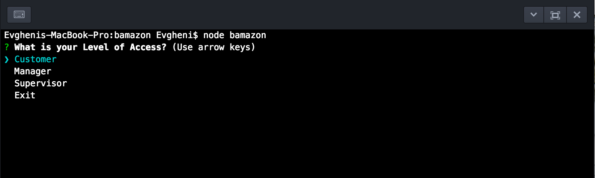
   
 ##
 ##
 
 Level one: Customer
 
  -- pulling data from databases and presenting the table to the customer
  
  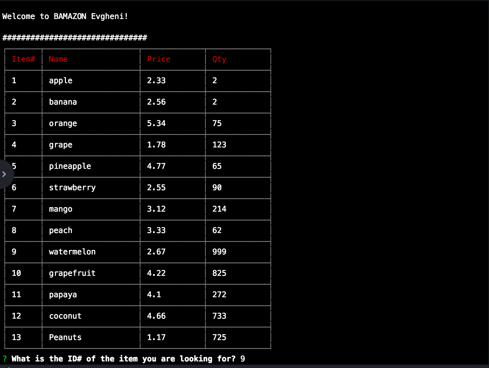
  
  
  -- customer is placing an order 
  
  
  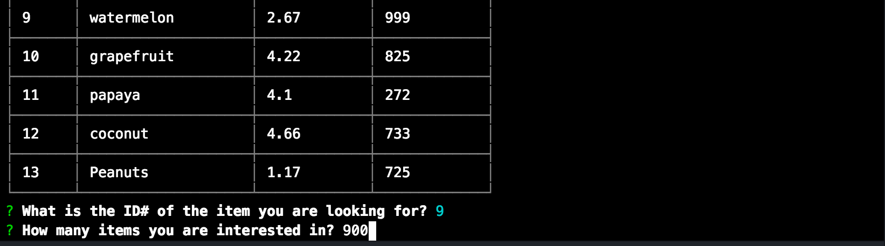
  
  
  -- if qty in our database is enough  
  
  
  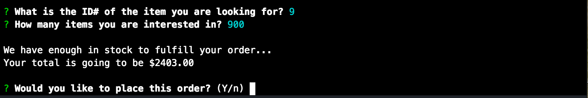
  
  
  -- confirming the order and updating the databases
  
  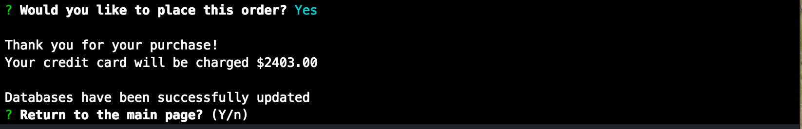
  
  -- if qty is not enough
  
  
  
  
  -- databases are updated now. New qty has been reflected 
  
  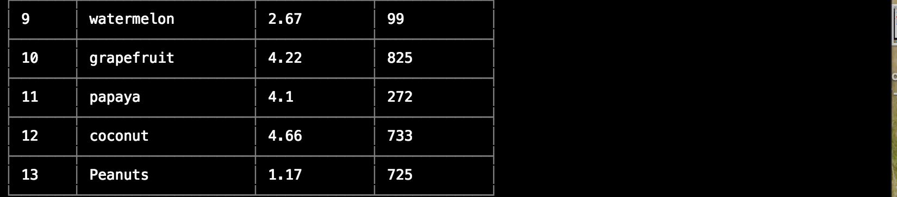
  
  ##
  
  Level two: Manager
  
  -- manager's menu
 
 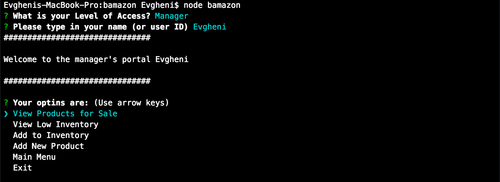
 
 -- products for sale available in mananger portal
 
 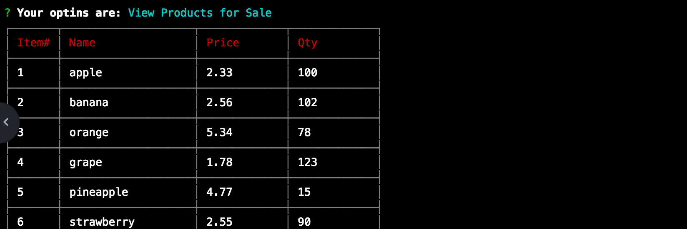
 
 -- item with qty below 5
 
 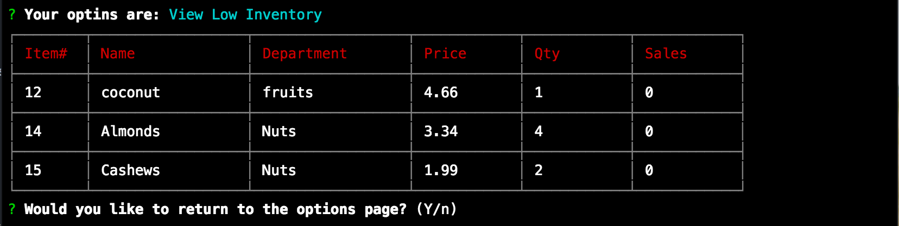
 
 -- restocking 
 
 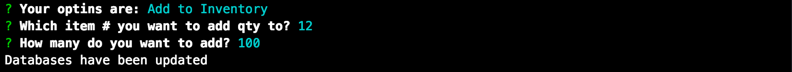
 
 -- new qty is been reflected in our databases
 
 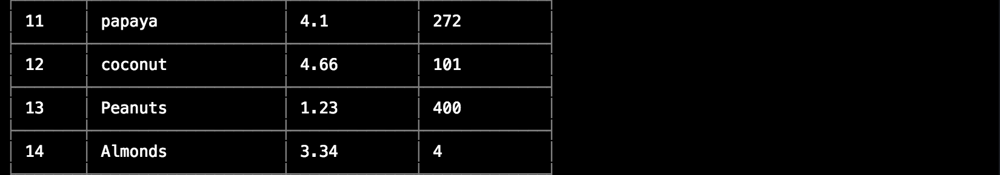
 
 -- adding a new product to our databases
 
 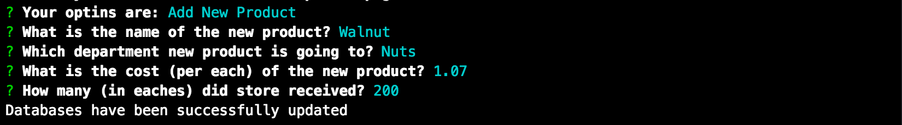
 
 -- and ... new item it's been added
 
 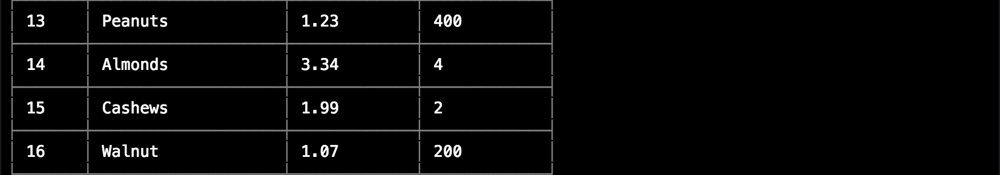